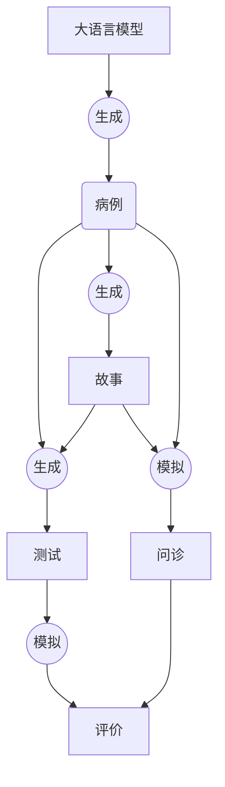

# CSTAR 是什么？

**CSTAR** 是基于人工智能领域下的大语言模型技术实现的一种虚拟病例研究模式，专注于虚拟病例的高效生成和广泛应用。大语言模型可以通过对话补全实现病例生成（**Case**）、故事撰写（**Story**）和设计问题（**Test**），并通过角色扮演的能力在虚拟病人问诊（**Act**）和模拟问答（**Rate**）上发挥重要作用。

## CSTAR 模式示意图

