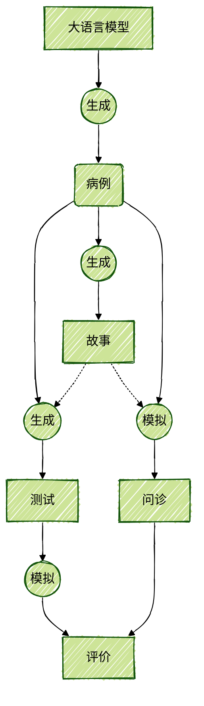

# 简介

## CSTAR 是什么？

**原始文字**

**CSTAR** 是基于人工智能领域下的大语言模型技术实现的一种虚拟病例研究模式，专注于虚拟病例的高效生成和广泛应用。大语言模型可以通过对话补全实现病例生成（**Case**）、故事撰写（**Story**）和设计问题（**Test**），并通过角色扮演的能力在虚拟病人问诊（**Act**）和模拟问答（**Rate**）上发挥重要作用。

**专业严谨风格**

**CSTAR** 是一种基于人工智能大语言模型技术构建的虚拟病例研究模式。该模式以虚拟病例的高效生成与广泛运用为核心目标。大语言模型能够凭借其对话补全功能，精准完成病例生成（Case）、故事撰写（Story）以及设计问题（Test）等关键任务。同时，它所具备的角色扮演能力，使其在模拟虚拟病人问诊（Act）以及开展模拟问答（Rate）环节中，展现出极为重要的作用，为医学教育领域带来了创新且高效的实践方式。

**清晰易懂风格**

**CSTAR** 是依托于人工智能领域的大语言模型技术而诞生的一种虚拟病例研究模式。简单来说，它主要聚焦于快速生成虚拟病例，并将这些病例广泛应用于各种场景。大语言模型就像是一个智能助手，可以通过对话补全的方式，轻松完成病例的生成（Case）、相关故事的撰写（Story）以及设计有针对性的问题（Test）。而且，它还能通过角色扮演，在模拟虚拟病人与医生问诊（Act）以及模拟问答（Rate）等环节中发挥关键作用，为医学教育提供了一种全新的、高效的研究与实践模式。

**引人入胜风格**

在医学教育的广阔天地里，**CSTAR** 如一颗璀璨的新星正冉冉升起。它是一种基于人工智能大语言模型技术打造的虚拟病例研究模式，致力于让虚拟病例的生成变得高效无比，并将这些病例广泛应用于教学、研究等众多领域。想象一下，大语言模型就像一位充满智慧的魔法师，通过对话补全的神奇力量，能够瞬间完成病例生成（Case）、编织引人入胜的故事（Story）以及精心设计出富有挑战性的问题（Test）。更令人惊叹的是，它还能凭借出色的角色扮演能力，在模拟虚拟病人问诊（Act）以及模拟问答（Rate）的舞台上大放异彩，为医学教育开辟了一条充满无限可能的新路径。

## 模式示意图

