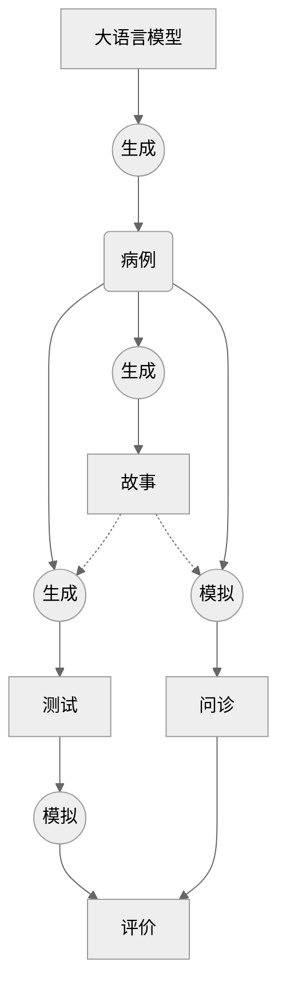

# 入门指南

[URDOC](https://urdoc.dearfad.com) **虚拟病例研究平台** 是 CSTAR 方法在临床医学学习中的具体实践，基于人工智能领域下的大语言模型技术实现的一种虚拟病例研究模式，专注于虚拟病例的高效生成和广泛应用。大语言模型可以通过对话补全实现病例生成、故事撰写和设计问题，并通过角色扮演的能力在虚拟病人问诊和模拟问答上发挥重要作用。

## CSTAR

| 定义  | 说明 |                                  解释                                  |
| :---: | :--: | :--------------------------------------------------------------------: |
| Case  | 事例 |      包括案例、病例、情况等，需要学习的知识所体现出具体事情的范例      |
| Story | 故事 | 知识的产生必然伴随着相关的场景和需求，结合背景才能真正的理解和运用知识 |
| Test  | 测试 |            通过知识理论形成相关的问题，考察对知识的理解程度            |
|  Act  | 实践 |     对知识或事件理解后，从处理过程中了解如何运用相关知识解决问题。     |
| Rate  | 评价 |      从理论和实践上多角度评价所学知识，才能获得更完整的理解知识。      |

## 模式示意图

