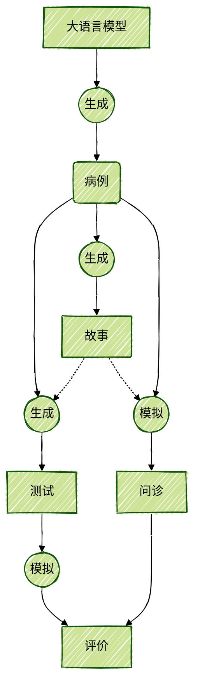

# URDOC 是什么？

## 定义

URDOC 是 CSTAR 方法在临床医学学习中的具体实践。

## 描述

- **原始文字**

  **CSTAR** 是基于人工智能领域下的大语言模型技术实现的一种虚拟病例研究模式，专注于虚拟病例的高效生成和广泛应用。大语言模型可以通过对话补全实现病例生成（**Case**）、故事撰写（**Story**）和设计问题（**Test**），并通过角色扮演的能力在虚拟病人问诊（**Act**）和模拟问答（**Rate**）上发挥重要作用。

- **专业严谨风格**

  **CSTAR** 是一种基于人工智能大语言模型技术构建的虚拟病例研究模式。该模式以虚拟病例的高效生成与广泛运用为核心目标。大语言模型能够凭借其对话补全功能，精准完成病例生成（Case）、故事撰写（Story）以及设计问题（Test）等关键任务。同时，它所具备的角色扮演能力，使其在模拟虚拟病人问诊（Act）以及开展模拟问答（Rate）环节中，展现出极为重要的作用，为医学教育领域带来了创新且高效的实践方式。

- **清晰易懂风格**

  **CSTAR** 是依托于人工智能领域的大语言模型技术而诞生的一种虚拟病例研究模式。简单来说，它主要聚焦于快速生成虚拟病例，并将这些病例广泛应用于各种场景。大语言模型就像是一个智能助手，可以通过对话补全的方式，轻松完成病例的生成（Case）、相关故事的撰写（Story）以及设计有针对性的问题（Test）。而且，它还能通过角色扮演，在模拟虚拟病人与医生问诊（Act）以及模拟问答（Rate）等环节中发挥关键作用，为医学教育提供了一种全新的、高效的研究与实践模式。

- **引人入胜风格**

  在医学教育的广阔天地里，**CSTAR** 如一颗璀璨的新星正冉冉升起。它是一种基于人工智能大语言模型技术打造的虚拟病例研究模式，致力于让虚拟病例的生成变得高效无比，并将这些病例广泛应用于教学、研究等众多领域。想象一下，大语言模型就像一位充满智慧的魔法师，通过对话补全的神奇力量，能够瞬间完成病例生成（Case）、编织引人入胜的故事（Story）以及精心设计出富有挑战性的问题（Test）。更令人惊叹的是，它还能凭借出色的角色扮演能力，在模拟虚拟病人问诊（Act）以及模拟问答（Rate）的舞台上大放异彩，为医学教育开辟了一条充满无限可能的新路径。

## 模式示意图

## 现状

### 目前流行的医学学习方法有哪些？

::: info
本段文字 2025 年 5 月 19 日生成于 Kimi App "目前流行的医学学习方法有哪些？"
:::

- **微学习（Microlearning）**

  微学习是将复杂的学习内容分解为简短、专注的模块，使学习者能够专注于掌握一个概念后再进入下一个。研究表明，微学习可以将知识保留率提高多达 22%，特别适合医学领域的技能训练。

- **翻转课堂（Flipped Classroom）**

  翻转课堂模式将传统的课堂教学内容前置，学生在课前通过视频、阅读等方式自主学习基础知识，课堂时间则用于讨论、协作练习和解决问题。这种方法可以提高学生参与度和学习效果，研究表明其能将学生表现提升 12%。

- **案例学习（Case-Based Learning, CBL）**

  案例学习通过提供真实的临床案例，让学生在团队中分析患者病史、症状、检查结果等，制定诊断和治疗方案。这种方法能够将理论与实践相结合，培养学生的临床思维和团队协作能力。但其需要额外的时间准备，并且对教师和学生的参与度要求较高。

- **基于模拟的学习（Simulation-Based Learning, SBL）**

  模拟学习通过模拟真实的临床场景，让学生在虚拟环境中练习临床技能，减少对真实患者的依赖。这种方法允许学生在不伤害患者的情况下犯错误并从中学习，特别适用于复杂医疗程序的训练。然而，模拟设备和软件的成本较高，且需要专业的培训。

- **电子学习（E-Learning）**

  电子学习利用互联网资源，如视频讲座、在线课程、社交媒体等，为学生提供灵活的学习方式。学生可以通过在线平台学习临床操作、解剖演示等内容，还可以通过视频会议等方式与教师和同学互动。但需要注意的是，网络信息的质量参差不齐，需要进行筛选。

- **观察学习（Observational Learning）**

  观察学习是指学生通过观察他人的操作来学习技能，这种方法在医学中尤为重要，因为许多医疗操作需要适应复杂多变的环境。观察学习可以增强学生的视觉空间能力，提高技能水平，但需要结合实际操作才能达到最佳效果。

- **基于团队的学习（Team-Based Learning, TBL）**

  基于团队的学习是一种以学生为中心的学习策略，学生在小组中通过讨论、解决问题等方式应用所学知识。这种方法可以提高学生的沟通能力和团队协作能力，但需要学生积极参与，教师也需要提供适当的引导。

- **问题导向学习（Problem-Based Learning, PBL）**

  问题导向学习通过提出问题，让学生自主探索解决方案，培养学生的自主学习能力和问题解决能力。这种方法能够激发学生的学习兴趣，但需要教师提供适当的引导和支持。

- **证据医学学习（Evidence-Based Medicine, EBM）**

  证据医学学习强调基于科学证据的医学决策，学生需要学会查找、评估和应用医学文献中的证据，以支持临床实践。这种方法可以提高学生的批判性思维和循证医学能力。

这些学习方法各有优势，结合使用可以更好地满足医学教育的需求，培养出具备扎实专业知识和实践能力的医学人才。
