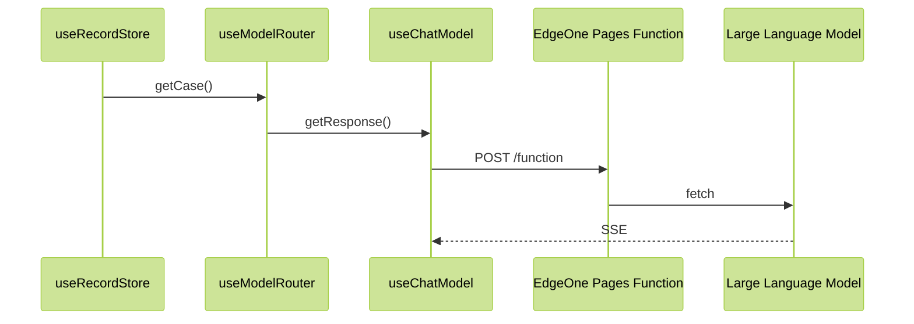

# 流程图

## 创建病例流程图

```mermaid
---
config:
    theme: forest
    look: handDrawn
    layout: dagre
---
sequenceDiagram
  participant useRecordStore
  participant useModelRouter
  participant useChatModel
  participant function as EdgeOne Pages Function
  participant LLM as Large Language Model
  useRecordStore->>useModelRouter: getCase()
  useModelRouter->>useChatModel: getResponse()
  useChatModel->>function: POST /function
  function->>LLM: fetch
  LLM-->>useChatModel: SSE
```
